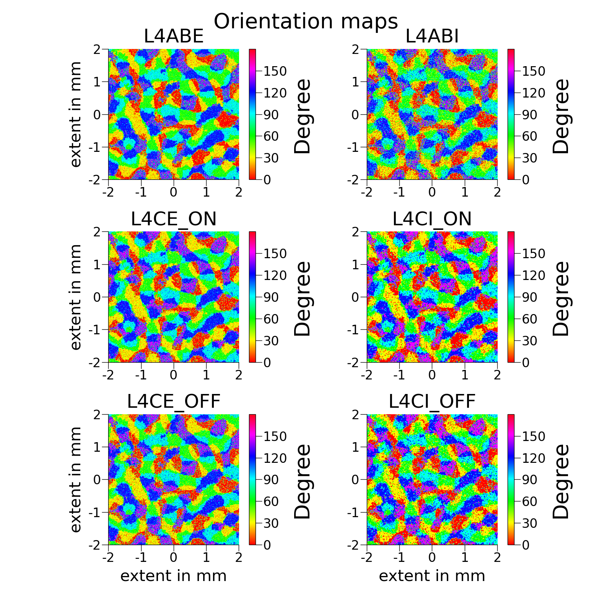
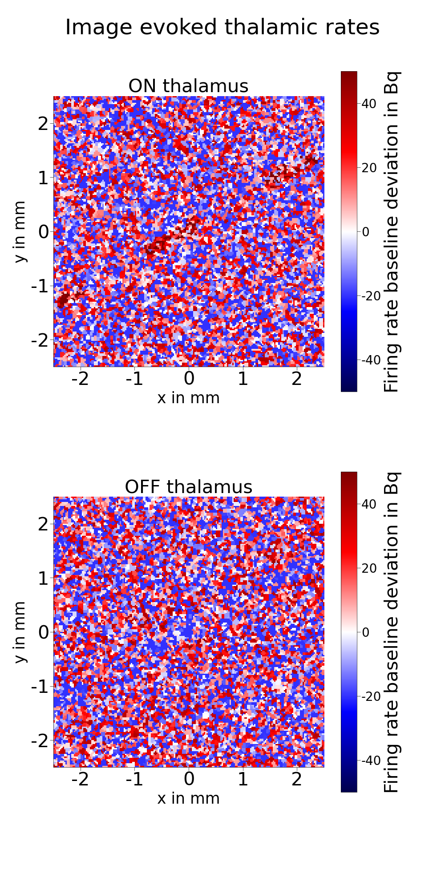
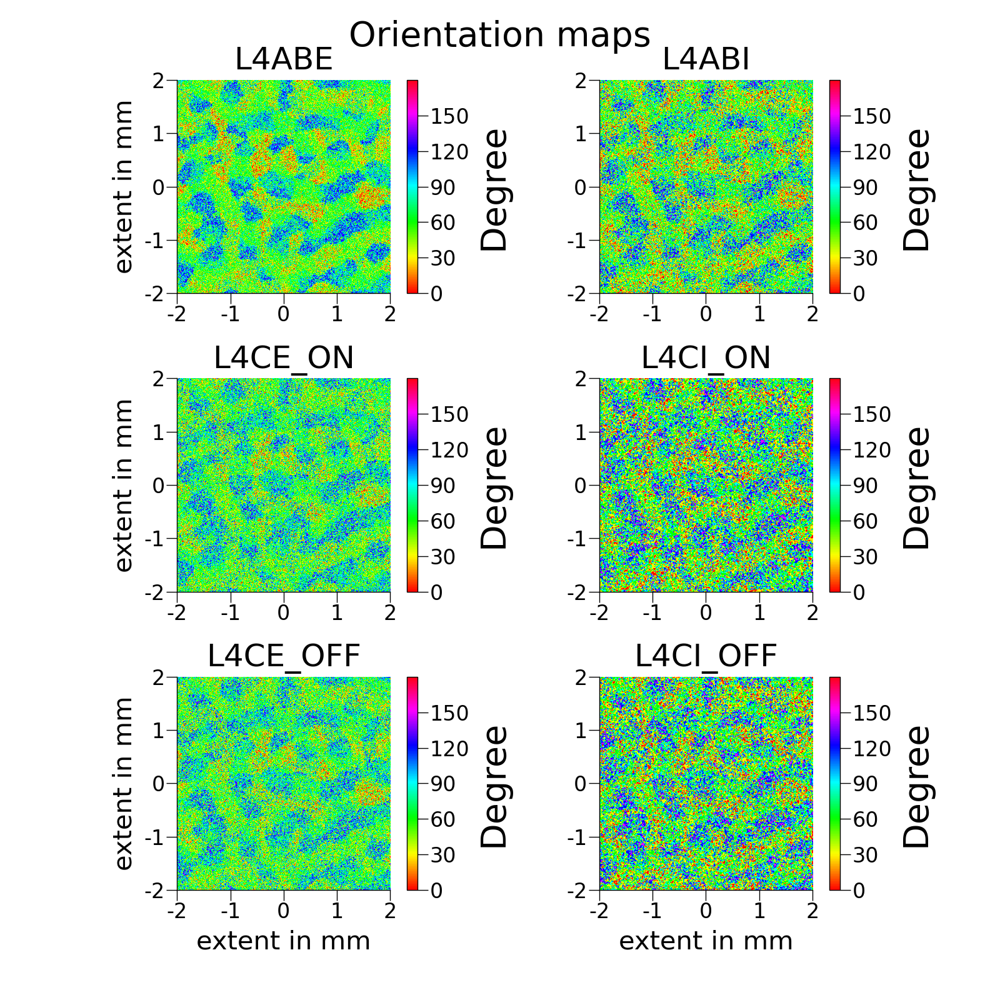

# Visual Cortex Simulation: 85% Orientation Decoding from Neural Populations

[](Masterarbeit_final.pdf)
[](https://www.python.org/)
[](https://www.nest-simulator.org/)

> 1M-neuron model of macaque visual cortex achieving **85% accuracy** in decoding orientation from noisy neural population activity — demonstrating robust biological computation without supervised learning.


*Spatiotemporal spiking dynamics across 25mm² (16mm² depicted) cortical patch. **Top:** Population activity waves | **Middle:** Thalamic input | **Bottom:** Individual spike trains*

---

## 🧠 What This Project Does

Built a biologically-constrained 1M-neuron spiking neural network to understand how the brain processes visual information. The model processes visual stimuli (gratings, bars, dashed bars) through simulated retina → thalamus → cortex pathway and exhibits emergent spatiotemporal dynamics.

**Core Question:** How do large neural populations reliably decode information (visual orientation) from noisy, spatiotemporal signals?

**Answer:** Through biologically-plausible literature backed connectivity patterns alone — no gradient descent or supervised training needed.

---

## 🎯 Key Result: Over 85% Orientation Decoding Accuracy

**Task:** Decode each neuron's preferred visual orientation from its spiking responses to moving gratings.

**Method:** Presented gratings at 6 different orientations (0°, 30°, 60°, 90°, 120°, 150°) → measured each neuron's spiking response → assigned the orientation it responded to most strongly.

**Result:** **85% match** with ground truth orientation map.

### Orientation Map Retrieval (Strong Input)



**85% of neurons correctly decoded** — Colors represent preferred orientation (red=0°, green=60°, blue=120°, etc.). Clear iso-orientation domains (patches of same color) show the network reliably extracts orientation information from visual signals. 6 populations shown: L4ABE (excitatory layer 4A/B), L4ABI (inhibitory 4A/B), L4CE_ON/OFF (excitatory 4C), L4CI_ON/OFF (inhibitory 4C).

### Noise Resistance Test

**Challenge:** Can the network decode orientation from heavily degraded signals?

<p align="center">
  
  <br>
  <em>Noisy thalamic input (Signal to noise ratio 0.5) — a much harder decoding challenge</em>
</p>

<p align="center">
  
  <br>
  <em>Orientation maps still retrieved despite extremely heavy noise — demonstrating robust population-level coding</em>
</p>

### What This Demonstrates

1. **Robust decoding:** Network maintains orientation selectivity at signal to noise ratios of 0.5
2. **Population coding:** Individual neurons can be noisy, but population responses are reliable  
3. **No supervised learning:** Orientation selectivity emerges purely from biological connectivity rules
4. **Biological validity:** Matches experimental recordings from macaque V1
5. **BCI relevance:** Same principles apply to decoding information from noisy EEG/neural signals

**Key innovation:** Achieved through Hebbian-inspired connectivity patterns — no backpropagation or gradient descent.

---

## 🔬 Technical Highlights

### Scale
- **1,000,000 neurons** across 4 cortical layers (L4A/B, L4C ON/OFF pathways)
- **1,000,000,000+ synapses** with biologically realistic connectivity
- **20,000,000,000+ datapoints** processed (0.1ms resolution, 20s simulations)
- **25mm² (16mm² depicted) cortical area** (central visual field representation)

### Architecture
- **Leaky Integrate-and-Fire neurons** (conductance-based, biologically realistic)
- **Distance-dependent connectivity** (exponentially decaying spatial profiles)
- **Orientation-selective patterns** (patchy long-range + push-pull short-range)
- **Two types of inhibitory neurons** (super localized + elliptical)
- **Realistic synaptic delays** (distance + conduction velocity)

### Input Processing Pipeline
- **Retina preprocessing:** Center-surround receptive fields (Mexican hat filters)
- **ON/OFF pathways:** Mimicking biological thalamic ON and OFF cells
- **Gabor-based projections:** Thalamocortical connections creating orientation selectivity
- **Visual stimuli:** Moving gratings, bars, dashed patterns and noisy dashed bars

### Key Technical Achievement
**No gradient descent** — network topology inspired through biologically-plausible Hebbian-like connectivity rules, demonstrating that biological constraints alone produce robust computation.

---

## 🎯 Applications & Relevance

This work directly applies to:

**Brain-Computer Interfaces (BCIs):**
- Understanding population-level neural coding for visual decoding
- Principles for decoding from noisy EEG/neural signals
- Robust signal processing under high noise

**Neuromorphic Computing:**
- Biologically-inspired architectures for edge AI
- Event-driven spiking computation
- Energy-efficient neural processing

**Computational Neuroscience:**
- Testing theories of cortical processing
- Understanding orientation selectivity emergence
- Population coding mechanisms

**Medical Applications:**
- Understanding visual processing disorders
- Neural prosthetics design
- Diagnostic tools for visual system

**Why it matters:** Real brains work with noisy, sparse, asynchronous spikes. This model shows how robust computation emerges from biological constraints — principles applicable to EEG decoding, neuromorphic hardware, and explainable AI.

---

## 💻 Technical Stack

- **Simulator:** [NEST Neural Simulation Tool](https://www.nest-simulator.org/) 3.x
- **Language:** Python 3.8+
- **HPC:** SLURM job scheduling on compute clusters
- **Analysis:** NumPy, SciPy, Matplotlib
- **Data Scale:** ~500GB per full simulation run
- **Compute:** Multi-node HPC (100+ cores typical)

---

## 📖 Full Thesis

**Title:** "Stabilization of the Orientation Map in a Computational Model of L4 in V1 of Macaque Monkey"

[📄 Read Full Thesis (PDF)](Masterarbeit_final.pdf)
[📄 Final Presentation (PDF)](Master_colloquium.pdf)

**Abstract:** Visual cortex layer 4 exhibits orientation selectivity—neurons respond preferentially to edges of specific angles. This thesis investigates the connectivity patterns that stabilize this "orientation map" under noisy, dynamic input, using a large-scale spiking neural network model constrained by experimental neuroscience data.

**Key Contributions:**
- 85% orientation decoding accuracy from neural population activity
- Demonstrated noise resistance (50%+ noise tolerance)
- Identified connectivity patterns (patchy, push-pull) stabilizing orientation maps
- Validated against experimental V1 recordings
- Showed emergent spatiotemporal dynamics from local connectivity

**Institution:** Forschungszentrum Jülich (IAS-6 Computational and Systems Neuroscience) & RWTH Aachen University  
**Grade:** 1.0 (Best) | **Period:** Nov 2022 – Mar 2024

---

## 📧 Contact

**Silas Theinen**  
Computational Neuroscientist | Neural Signal Processing

- 📧 silas.theinen@rwth-aachen.de
- 💼 [LinkedIn](https://linkedin.com/in/silas-theinen-058977358)
- 🐙 [GitHub](https://github.com/SATheinen)

*Interested in computational neuroscience, BCIs, or large-scale neural simulations? Let's connect!*

---

## 📝 Citation

If you find this work useful for your research:

```bibtex
@mastersthesis{theinen2024visual,
  title={Stabilization of the Orientation Map in a Computational Model of L4 in V1 of Macaque Monkey},
  author={Theinen, Silas},
  year={2024},
  school={RWTH Aachen University and Forschungszentrum J\"ulich},
  note={85\% orientation decoding accuracy from 1M-neuron spiking network}
}
```

---

## 🙏 Acknowledgments

This work was conducted at the Institute for Advanced Simulation (IAS-6) at Forschungszentrum Jülich, using their HPC infrastructure. Special thanks to the NEST development team for their excellent neural simulation toolkit.

---

## 💡 Key Takeaways

- ✅ **85% accuracy** in orientation decoding from neural population activity
- ✅ **Robust to 50%+ noise** — maintains performance under high noise
- ✅ **No supervised learning** — emerges from biological connectivity alone
- ✅ **1M neurons, 1B synapses, 20B datapoints** — large-scale realistic simulation
- ✅ **Biologically validated** — matches experimental V1 recordings
- ✅ **Applicable to BCIs** — principles for decoding noisy neural signals

---

*Note: Due to computational scale (1M+ neurons, 1B+ synapses), full simulation code requires HPC resources. Contact me for implementation details or collaboration opportunities.*
